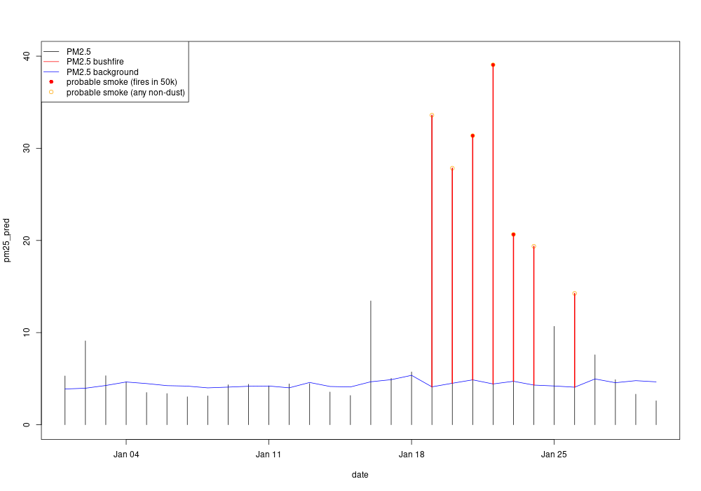
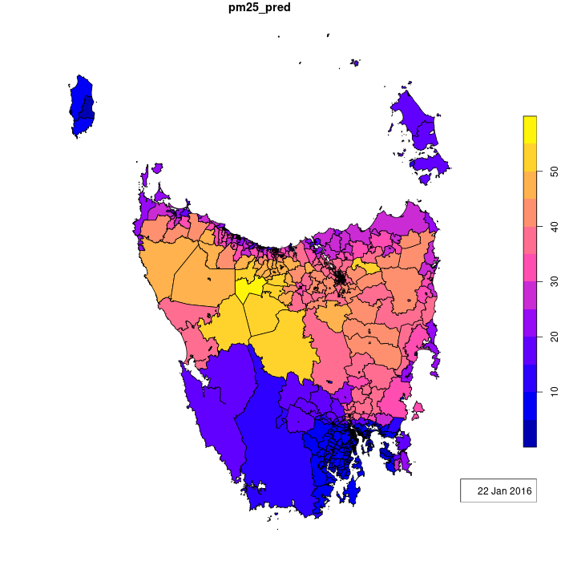
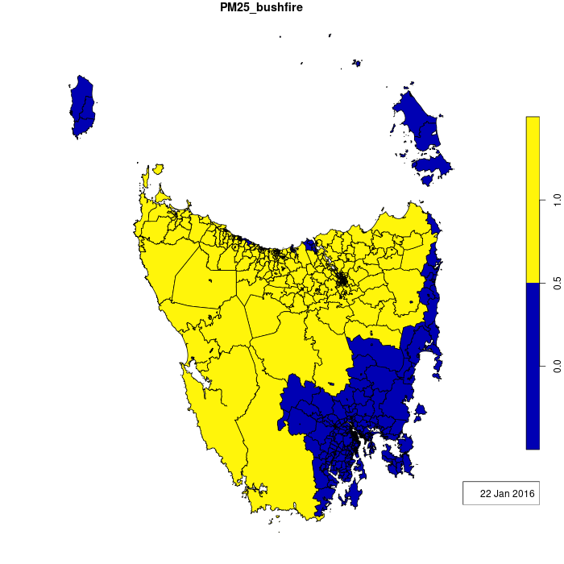

# Bushfire smoke data sharing with netCDF

## Installation
Miniforge makes it easier to manage the installation of Python, launch applications and manage packages and environments. To install Miniforge, please follow the most up to date instructions found in https://github.com/conda-forge/miniforge.

## Setting up and updating a conda environment
A conda environment allows you to have multiple sets of packages installed at the same time, making reproducibility and upgrades easier. You can create, export, list, remove and update environments that have different versions of Python and/or packages installed in them.

You can create a conda environment for this project using the following instructions.

Open your terminal and navigate to this repository directory in the terminal. For example, if you have downloaded this repository on your desktop, you could type the following.

On Mac/Linux:
```
% cd Desktop/smoke_data_Ivan
```

On Windows:
```
% cd Desktop\smoke_data_Ivan\
```

To install and activate the required environment, type:
```
% conda create -n smoke_data python=3.8 gdal nco cdo
% conda activate smoke_data
```

To deactivate the environment, type:
```
% conda deactivate 
```

## Usage
The following files are designed to sort, pre-process and merge the data. In order for this to function, the scripts are required to be run seqentially.
1. file_sort.py - Sorts the ASDAF Smoke Data by layer and year
2. batch_translate.sh - Calls netcdf_translate.sh on specific layers of the ASDAF Smoke Data and merges them into a single file spanning the entire 2001 to 2020 time period.
3. merge_clean.sh - Merges the bands/layers of the ASDAF Smoke data into a single netCDF.

### file_sort.py
This script assumes that your files are stored in a flat structure (i.e. all daily files for each layer are stored in a single directory). It will create subfolders for each layer and within, it will create subfolders for each year. You can modify the layers by editing file_sort.py in your preferred editor.
To run this script, you will need to parse in arguments the source and target destinations of where your files are located.
```
% python3 file_sort.py <source_directory> <destination_directory>
```

### batch_translate.sh
This script is used to translate specific layers of the ASDAF Smoke Data stored as geoTIFFs into the netCDF 4 format, then merges them into a single file spanning the entire 2001 to 2020 period. You can modify the time period by editing batch_translate.sh in your preferred editor.
To run this script, you will need to parse in the source destination of where your sorted files are located and name of your layer.
```
% sh batch_translate.sh <source_directory> <layer_name>
```

### merge_clean.sh
This script is used to merge multiple layers of the ASDAF Smoke Data located in ```/merged_files``` into a single netCDF 4 file, compresses it using d9 compression and then updates the file metadata to ensure CF compliance.

09/03/2022 - Placeholders have been used for updating the metadata.

IMPORTANT: there should be one file for EVERY time point or else you will get a message like `Warning: Input stream 1 has 7121 timesteps. Stream 5 has more timesteps, skipped!` and the data will not be correct.

To run this script, you will need to parse in the directory of the merged files (e.g. ```/data/merged_files```).
```
% sh merge_clean.sh <source_directory>
```

With R we can assign smoke levels to ABS census geographic units and use indicator flags of dust or active fire to identify probable smoke events (see `do_extract_abs_sa1.R`:



And here is some maps of SA1 census geography units with spatially weighted PM2.5 and identified bushfire smoke areas:





